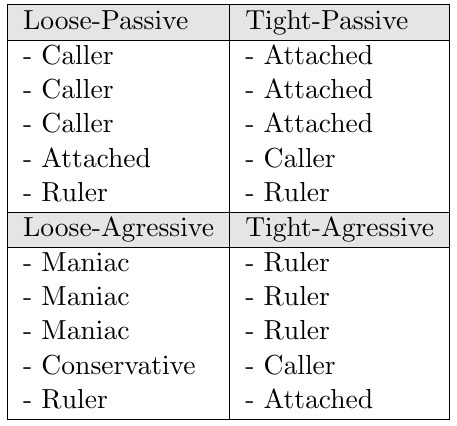
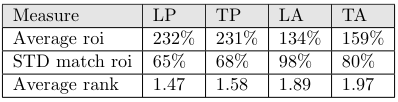
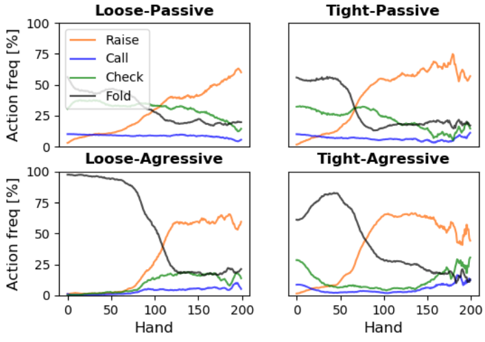
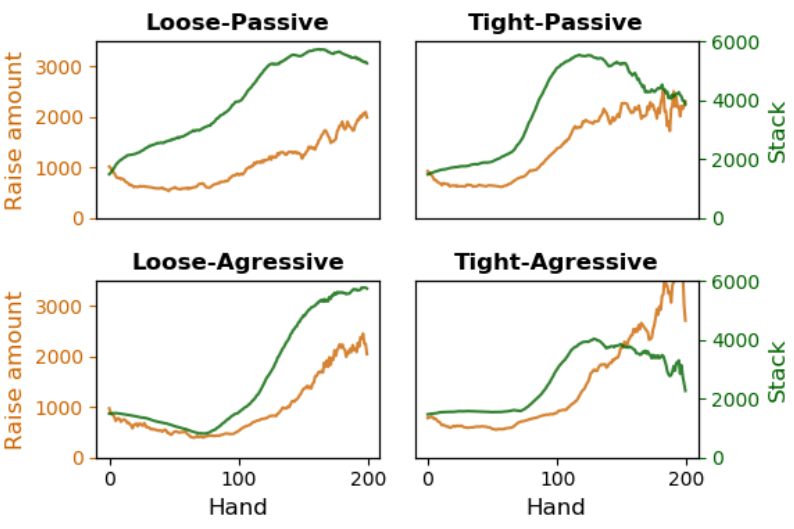
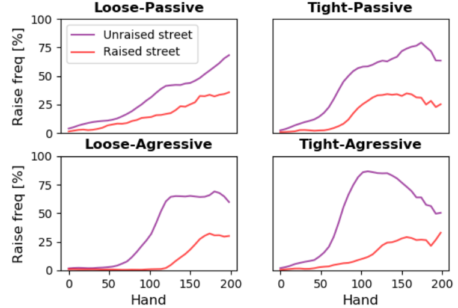

# deepbot-poker

This repository implements a bot playing No Limit Texas Hold'em poker. It has been trained to play 6-handed sit-and-go as well as heads-up ring-games. The model is built on a neural network, trained with a genetic algorithm. It tracks the game as a whole as well as each opponent separately. LSTMs are used for memory, taking advantage of the sequential nature of poker. The [detailed report](https://github.com/tamlhp/deepbot-poker/tree/master/docs/Deepbot_report.pdf) and corresponding [presentation](https://github.com/tamlhp/deepbot-poker/tree/master/docs/Deepbot_presentation.ppt) can be found in the docs alongside other important files.

Below is an overview of the neural network used at the core of the decision making of the last iteration of DeepBot.
<p align="center">
</p>
<p align="center"><u>Six handed neural network overview</u></p>


## Getting started
### Setting up
First clone the repository with the recursive argument. This is to include two necessary submodules (PyPokerEngine and OMPEval). Both are forks that have been altered for the purpose of this project.
```
git clone https://github.com/tamlhp/deepbot.poker.git --recursive
```

This code was developed and tested with python 3.5.6. All the required python libraries are in the requirements file and can be installed with
```
pip install -r requirements.txt
```
In order to perform trainings, it is also required to have [redis](https://redis.io/) installed.

### Run default game
In order to verify that everything is set up correctly, it is appropriate to let a trained agent play and watch the trace of the game. To do so with the default options, simply move to  the code folder and run the agent_play script.
```
python3 agent_play.py
```

## Training a new agent
### Redis server and workers
As a lot of games have to be played, redis is used to enable multi-threading and cloud computing. Go to [./code/redis](https://github.com/tamlhp/deepbot-poker/tree/master/code/redis), then run the redis server:
```
redis-server redis.conf
```
redis.conf binds the server to an address.

Then, start the workers:
```
sh run_workers.sh 70 127.0.0.1
```
The first argument (70) is the number of workers to start. This should be equal to the number of threads available on the machine, or the genetic algorithm population size if it is smaller. The second argument (127.0.0.1) is the ip address of the redis server, here it is local. If multiple machines are used for computation, the address should be changed both here and in redis.conf.

### Starting the training
To train an agent from scratch, use the script train_agent.py. It is best to have a look at the many available arguments first:
```
python3 train_agent.py -h
```
At the very least it is adviserd to define a simulation id (--simul_id), to avoid overwritting past training traces.
```
python3 train_agent.py --simul_id 1
```

### Training trace
The training process generates data for reproducibility, and the agents. It saves the decks used, the earnings obtained by the agents, and most importantly the agents in a lightweight format:
a single list containing all the parameters of its neural network.

The default location of training data is [./data/trained_agents_and_data](https://github.com/tamlhp/deepbot-poker/tree/master/data/trained_agents_and_data). As it takes a lot of storage, it is not included in the git repository.

A few agents are however available in [./data_trained_agents_git](https://github.com/tamlhp/deepbot-poker/tree/master/data/trained_agents_git). There are (partial) traces of three trainings:
- 6max_full: Plays 6 Handed Sit and Go against various opponent tables
- 6max_single: Plays 6 Handed Sit and Go against one opponent, the Ruler (see report)
- hu_second: Plays Heads Up Ring Game against various weak opponents

The best agent of each training instance is the first agent (best peformance) of the last generation (most trained).

### Training performance example
Here is an example of the return on investments (ROI) obtained by agents over the training. It is for the '6max_full' network and environment. The maximum attainable ROI is 300%. Each curve is for a table with different type of opponents.
<p align="center">
</p>
<p align="center"><u>Average ROI over generations</u></p>

## Post training scripts
### Make a trained agent play
To make a trained agent play a single game, one can use the agent_play script. Again, it is advised to look at the available arguments. For example to let the pre-trained 6max_full (git) agent play against a tight passive table, run:
```
python3 agent_play.py --network 6max_full --table_ind 2 --agent_file ../data/trained_agents_git/6max_full/gen_300/bots/1/bot_1_flat.pkl
```
This will print information about the actions taken and rewards given at each hand.

### GUI
As the various bots developed in this repository, including DeepBot, are compatible with PyPokerEngine, it is possible to play against them through a GUI. To do so use [PyPokerGUI](https://github.com/ishikota/PyPokerGUI).

### Analysis
The scripts to perform the validation, be it quantitative or qualitative, are in [./code/validations](https://github.com/tamlhp/deepbot-poker/tree/master/code/validations).

## Analysis
To validate that the trained bot is able to adapt to different strategies over the course of a game, it was put in games against 4 tables containing different type of opponents.
Here is the composition of each of the 4 tables and their title:

<p align="center">
</p>
<p align="center"><u>Table composition</u></p>

### Quantitative validation
For the quantitative analysis, the ROI and average rank are measured. The rank can go for 1, the first place, to 6, the last place.

<p align="center">
</p>
<p align="center"><u>ROI and rank</u></p>

### Qualitative analysis
Finally to see whether the bot has learnt sound strategies, its actions are observed. This can both be used to validate its learning, and to get some insights into what strategies are good.

Actions of the bot are observed over the course of its game. Note that a game is force-ended after 200 hands. We compare this over each table composition, side by side.

We first look at the actions taken by the bot.

<p align="center">
</p>
<p align="center"><u>Action taken per hand</u></p>

Then we look whether the bot properly sizes its bets and takes into account its stack size.

<p align="center">
</p>
<p align="center"><u>Bet sizing and bot's stack per hand</u></p>

Then we look how aggressive the bot is and whether it respects the bets of its opponents. We thus look at how often the bot raises on unraised streets (no one raised before), and raised streets (an oponent raised before).

<p align="center">
</p>
<p align="center"><u>Raise action on  per hand</u></p>

We can see from this that the same trained bot adopts a sounds strategy for each table, and that it is a different strategy for each table. This comes from the memory of the LSTMs.


More details and analysis can be found in the [detailed report](https://github.com/tamlhp/deepbot-poker/tree/master/docs/Deepbot_report.pdf).

## Contributor
- Cyril van Schreven

## Supervisors
- Thanh Tam Nguyen, Karl Aberer
